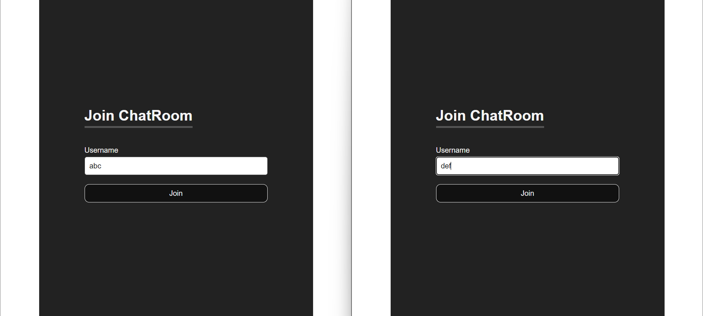
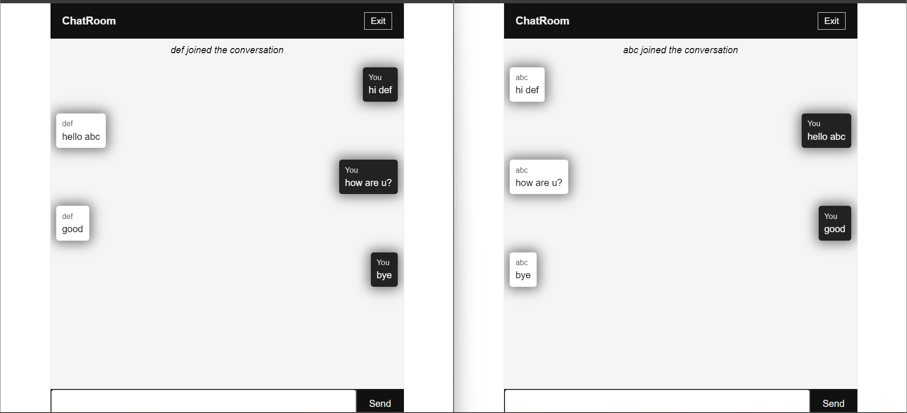
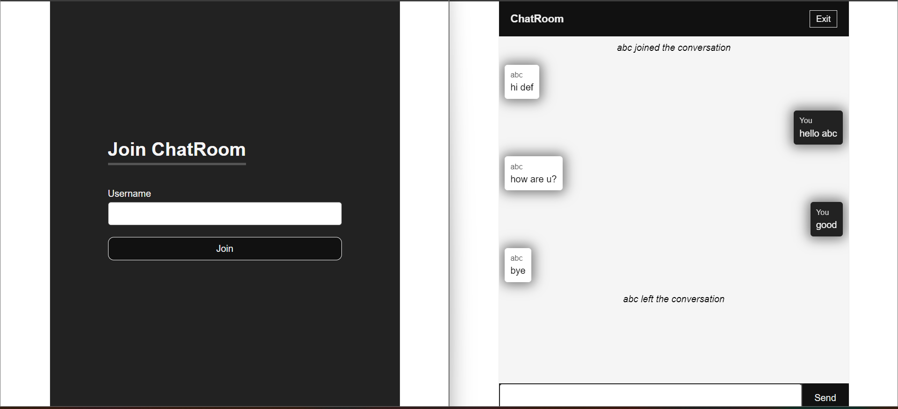

# Task 3- Real-Time Chat App using Socket.io

This is a real-time chat application built using HTML, CSS, JavaScript, Node.js, and WebSocket (Socket.io). It enables users to send and receive messages in real-time.






## Features

- Chat rooms: Users can join different chat rooms to communicate with others.
- Real-time messaging: Messages are sent and received in real-time using WebSocket (Socket.io).

  
## Technologies Used

- HTML
- CSS
- JavaScript
- Node.js
- WebSocket (Socket.io)

## Installation

1. Clone the repository:

   ```bash
   git clone https://github.com/your_username/chat-app.git
   ```

2. Navigate to the project directory:

   ```bash
   cd chat-app
   ```

3. Install dependencies:

   ```bash
   npm install
   ```

4. Start the server:

   ```bash
   node server.js
   ```

5. Open `index.html` in your web browser.

## Usage
1. Choose a chat room or create a new one.
2. Start sending and receiving messages in real-time.


## Contributing

Contributions are welcome! If you have any suggestions, enhancements, or bug fixes, feel free to open an issue or create a pull request.


